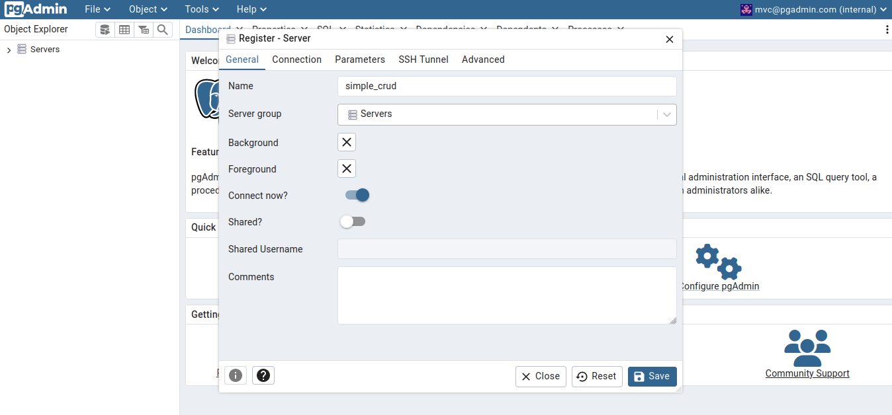
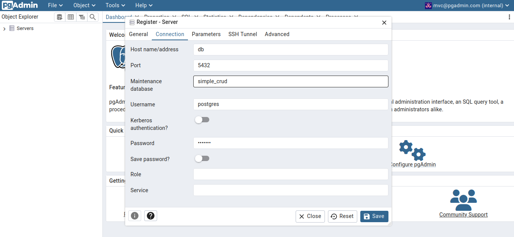
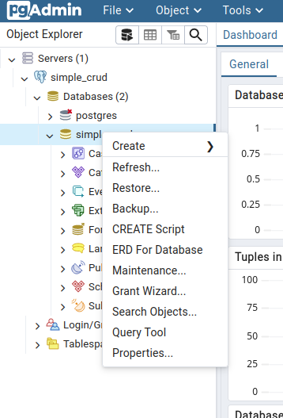
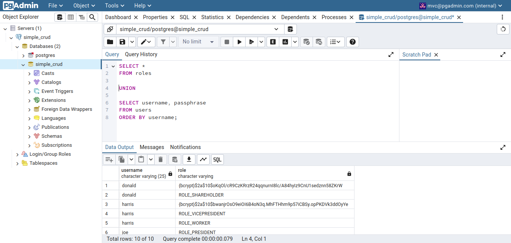

# Spring Boot Simple MVC Project


## A project to try out building a simple Spring Boot MVC prototype using containers and database.

---

## 1. Overview

* ### Used Technologies

	| 		Technology Name			|  Version  |
	| :----------------------------:	| :-------: |
	| Java JDK        				|     21    |
	| Spring Boot     				|           |
	| Maven           				|           |
	| PostgreSQL Image				|16.3-alpine|
	| Adminer Image					|	4.8.1   |
	| Docker          				|   27.0.3  |
	| Docker Compose    				|   2.28.1  |
	| PG Admin 4      				|    8.9    |


* ### For containers it is used the following distribution

	* **Database (PostgreSQL)**
	* **Database Manager / Editor (PG Admin 4)**
	* **Spring Boot App**


* ### The Database is going to have the following entities/tables

	* **Users**: 
		* *Username* (**PK**)
		* *Passphrase* (**char(68)**)

	* **Roles:**
		* *Username* (**FK**, **UK**)
		* *Role* (**varchar(20)**, **UK**)
	

* ### Used Maven Packages

	| 		Package name			| Version |
	| :------------------------:	| :-----: |
	| Spring Boot DevTools		| |
	| Spring Web 				| |
	| Spring Data JPA 			| |
	| Spring Data JPA PostgreSQL	| |
	| Spring Security 			| |


* ### Authentication Infos
	
	* It's enough the username and password
	
	* The default authentications have their infos equal to the table below:

	|  Username	| Passphrase	| 		  Roles 			| Enabled |
	| :--------:	| :--------:	| :--------------------:	| :-----: |
	|    joe	   	|  crud123 	| president, worker 		|   true  |
	|   donald	|  crud123 	| shareholder			|   true  |
	|   harris	|  crud123 	| vice-president, worker	|   true  |
	|   pence	|  crud123 	| client					|   true  |
	

* ### Check-List
	- [x] Read Me
	- [x] Database Container
	- [x] Authentication Tables
	- [ ] App Function Tables
	- [ ] Database Management / Editor Container
	- [ ] Database User Population
	- [ ] Spring Boot Basic Encrypted Authentication
	- [ ] Spring Boot MVC Pages

---

## 2. Manual Setup

* ### 1. Setup Database Service

	1. Before initializing the process it should be checked if docker is installed, it can be verified by running the following command: <br>
		```
		$ docker --version
		```
	In case it isn't installed the [original documentation of the docker compose might help you](https://docs.docker.com/compose/install/).
		
	2. In order to initialize / manipulate the database try to be on the same directory as the database docker compose file. The file is located on the project home directory. 

	3. Once at the ``docker/postgresql`` you can compose the docker of the database by running:
		```
		$ sudo docker compose -f docker-compose.yml up -d
		```
		Or (as root)	
		```
		# docker compose -f docker-compose.yml up -d
		```
	
		* To undo the previous step you can use the following command to **stop and remove all the containers**:
			```
			$ sudo docker compose down
			```
			Or (as root):
			```
			# docker compose down
			```
			
	4. Having arriving at this step you should be able to check if the database service is running by accessing the database. You can do it in two ways:
		
		1. Open the <localhost:2222>, you are even going to able to modify the database using the default user, password and database I left on the docker compose file of the postgreSQL - postgres, test123 and simple_crud (respectively).
		
		
		2. Check if the database is working and populated, by accessing and consulting the database:
	
		```
		$ sudo docker exec -it spring_boot_simple_mvc-db-1 psql -U postgres -d simple_crud
		simple_crud=# SELECT * FROM roles UNION SELECT username, passphrase FROM users ORDER BY username;
		```
		
		The output should be something like this:
		
		```
		 username |                                 role                                 
		 ----------+----------------------------------------------------------------------
		 donald   | {bcrypt}$2a$10$oKqOl/cR9CzKRrzR24qqnurnI8lc/A84hyIz9CnU1sedznn58ZKrW
		 donald   | ROLE_SHAREHOLDER
		 harris   | {bcrypt}$2a$10$bwanjrOsO9eiOI6B4oN3q.MhFTHhm9p57iCBSy.opPKDVk3ddOyYe
		 harris   | ROLE_VICEPRESIDENT
		 harris   | ROLE_WORKER
		 joe      | ROLE_PRESIDENT
		 joe      | ROLE_WORKER
		 joe      | {bcrypt}$2a$10$VbD2OgJB3bsJRP5cB2GQvuS5QxxSMIoqdi0w3z7ilo9Pz877.Dxzq
		 pence    | {bcrypt}$2a$10$N.A43rJ.AbWGuQcn1MUTZuLNc3dFj5cKcNdZK9./cKKQPMaVo65aS
		 pence    | ROLE_CLIENT
		(10 rows)
		```
		
		* To get out of the interactive mode (the *psql*) you can use the combination of `ctrl` + `d`.
		
		
		
		3. Try to use the PGAdmin4 by opening the <localhost:8888>, it may take a while to load the service. 
			1. Fill the PGAdmin4 fields as the image, the password is test123.<br>
			
			2. Select the add database options.
			3. Fill the database configurations as the images bellow. <br>
			
			
			4. Now you can try selecting the database query tool, you can get the result of the image by clicking with the right button on the database. <br>
			
			5. Try running the following thread, on the upper part of the image (`SELECT * FROM roles UNION SELECT username, passphrase FROM users ORDER BY username;`), and obtain the same result, at the bottom part of the image. <br>
			


* ### 2.

---